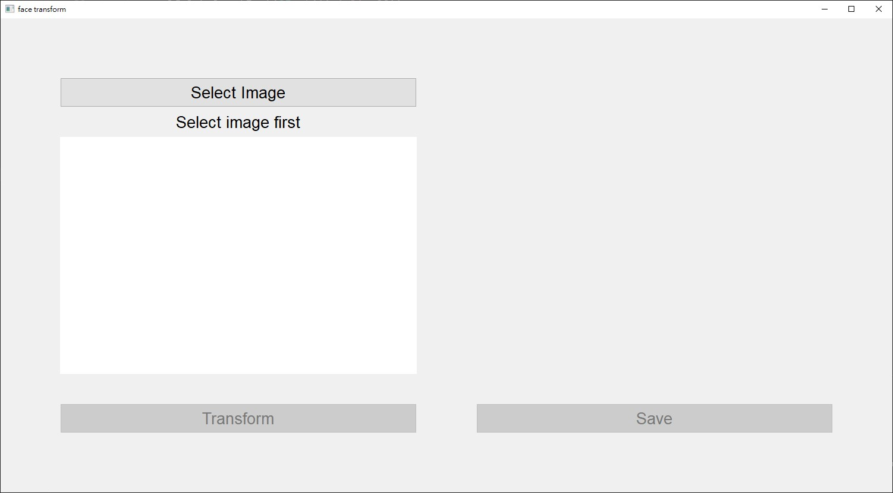
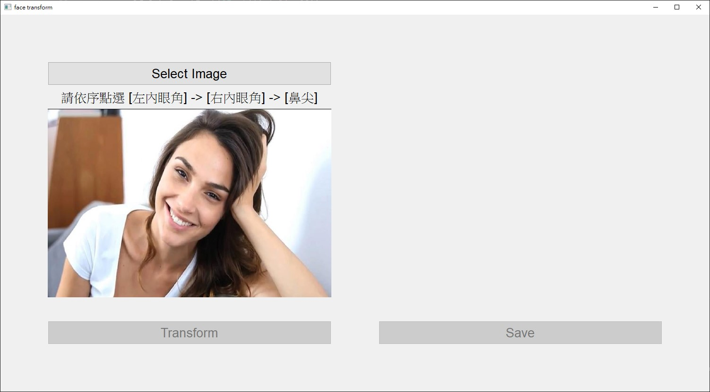
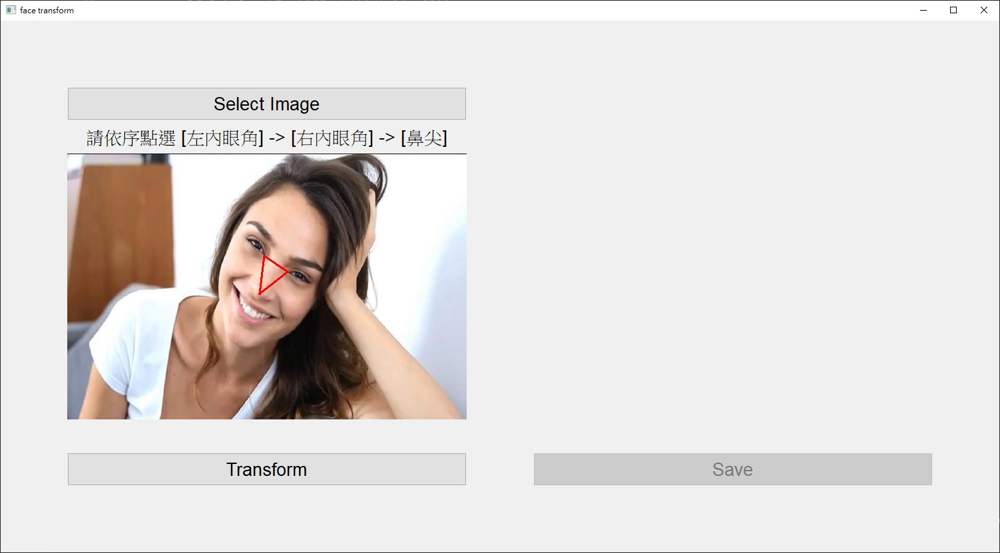
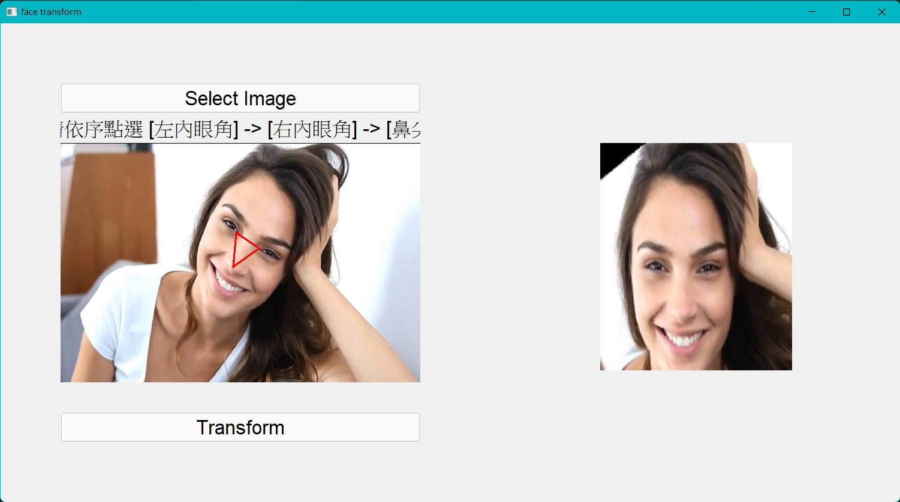

# ImageProcessing_HW2_AffineTransform
NCKU 110-1 影像處理與機器人視覺：基礎與設計 作業2


## 作業說明
將老師提供的人臉影像，利用affine transform，將人臉的位置轉換到固定位置的 template 上。output 一張影像，大小為 160 x 190，左右眼位置分別位於這張影像上的 (65, 90) 與 (95, 90)。鼻尖位於 (80, 120)。

作業繳交：
1. 程式原始碼。
2. 報告，說明原理及遭遇問題。
3. 測試照片，原始影像以及處理完影像。
4. 檔案名稱請依照第一個作業所規範。


## 環境
- python v3.9 [網站](https://pipenv-fork.readthedocs.io/en/latest/)
- pipenv 套件管理工具 [網站](https://pipenv-fork.readthedocs.io/en/latest/) 

## 使用說明
1. 下載專案
2. 移至專案目錄\
`cd /d ImageProcessing_HW2_AffineTransform`
2. 安裝所需套件\
`pipenv install`

## 功能實現
### Affine Transform Matrix Calculation
#### 程式碼
```python

```
#### 說明

### Affine Transform
#### 程式碼
```python
def apply_AffineTransform(src, matrix, dst_size):
    mat = np.concatenate((matrix, [[0, 0, 1]]), axis=0)

    targetPoint = [(mat @ np.array([[x], [y], [1]]))[:2, 0] for x, y in itertools.product(range(src.shape[1]), range(src.shape[0]))]
    sourcePoint = [[x, y] for x, y in itertools.product(range(src.shape[1]), range(src.shape[0]))]

    targetPoint = np.array(targetPoint, dtype=np.int32)
    sourcePoint = np.array(sourcePoint, dtype=np.int32)

    mask = (targetPoint[:, 0] < dst_size[1]) & (targetPoint[:, 1] < dst_size[0]) & \
        (targetPoint[:, 1] >= 0) & (targetPoint[:, 0] >= 0)
    targetPoint = targetPoint[mask]
    sourcePoint = sourcePoint[mask]

    dst = np.zeros([dst_size[0], dst_size[1], 3], dtype=np.uint8)
    dst[targetPoint[:, 1], targetPoint[:, 0]] = src[sourcePoint[:, 1], sourcePoint[:, 0]]

    return dst
```
#### 說明
將原圖片的每個座標點和轉換矩陣內積後得到新的座標點，並記錄原始做便和新座標的轉換位置，再將範圍內的像素複製到新的圖片中。

## 處理步驟說明
### Step 1 : 選取人物特徵位置
選定人臉的左右內眼角以及鼻尖作為固定點

### Step 2 : 計算轉換矩陣


### Step 3 : 轉換圖片
計算原始圖片各位置轉換後的新座標，並將像素點重新排列為新圖片

## 介面操作說明

### Step 1 : 選取圖片

### Step 2 : 點選位置


### Step 3 : 轉換
按下`Transform`按鈕開始轉換，完成後按下`Save`按鈕以儲存圖片  
儲存位置為`./results/<輸入的檔案名稱>.jpg`


## 結果
### 樣張 1
  

---
### 樣張 2
  

---
### 樣張 3
  

